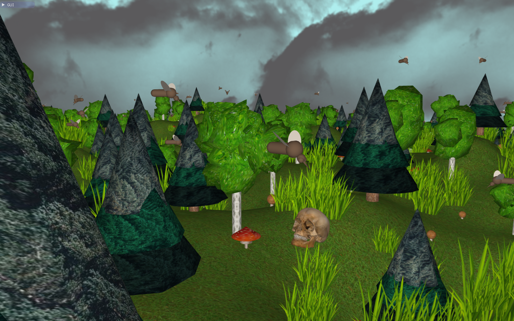

# 🌲 Floating Forest 3D

A 3D graphics project made in C++ with OpenGL and the [CGP library](https://github.com/drohmer/cgp).  
Explore a mysterious floating island, remnants of a catastrophic event. The forest may appear beautiful - but it can also be deadly.  
Animated snakes, flying mosquitoes, procedural terrain, and shader-powered vegetation create an immersive 3D world.

---

## 📁 Project Structure

```
/floating-forest-3D/
├── Project/
│   ├── assets/               # Textures, models, and other visual resources
│   ├── includes/             # Header files for scene objects and utilities
│   ├── shaders/              # Custom GLSL shaders (animated grass, trees, snakes, etc.)
│   ├── scripts/              # Utility scripts if any (e.g. for asset processing)
│   ├── src/                  # Main C++ source files (object creation, animation, logic)
│   │   ├── main.cpp          # Entry point of the application
│   │   ├── *.cpp / *.hpp     # Object-specific logic (tree, snake, mosquito, etc.)
│   ├── build/                # Build output folder (excluded from git)
│   ├── cmake-build-debug/    # VS Code / CLion specific CMake output
│   ├── CMakeLists.txt        # CMake build configuration
│   ├── Makefile              # Optional manual build script
│   ├── .vscode/              # VS Code configuration files
├── cgp/                      # External CGP library by Damien Rohmer (submodule or copy)
├── .gitignore
├── README.md
```

---

## 🛠 How to Build & Run

Make sure you have **CMake** (≥3.12) and a compiler with **C++17** support. The CGP library should be placed under `cgp/`, or properly linked in your CMake config.

```bash
# Clone the repository
git clone git@github.com:akochergina/floating-forest-3D.git
cd floating-forest-3D

# Create a build directory
mkdir build
cd build

# Generate build files with CMake
cmake ../Project

# Compile the project
make

# Run the executable
./main
```

> ✅ If you use **VS Code**, simply open the workspace and use the CMake Tools extension to configure and run the project.

---

## 🧠 Technical Overview

This project was designed with modularity and extensibility in mind. Each element of the scene is coded in its own module and rendered using OpenGL via the [CGP library](https://github.com/drohmer/cgp), which handles low-level rendering logic and camera interaction.

---

### 🌿 Scene Objects and Procedural Modeling

All objects in the scene (trees, mushrooms, grass, mosquitoes, snakes, skulls) are built from geometric primitives using helper functions from `mesh_primitive.cpp`. These primitives are then assembled into complex objects in their respective `*.cpp/.hpp` files.

| Object            | Geometry                              | Animation / Special Features                                  |
|-------------------|----------------------------------------|---------------------------------------------------------------|
| **Birch Tree**     | Cylinder trunk + 5 spheres (leaves)    | Custom leaf shader simulates movement via `birch.vert`        |
| **Pine Tree**      | Cylinder trunk + 3 cones (foliage)     | Reused snake shader to animate swaying foliage                |
| **Porcini Mushroom** | Cone stem + sphere cap               | Grows/shrinks rhythmically using periodic functions           |
| **Amanite Mushroom** | Cylinder + cone + colored textures    | Animated scaling with randomized timing                       |
| **Grass**          | Billboards always facing camera        | `grass.vert` shader animates waving effect                    |
| **Skull**          | Imported 3D mesh (`skull.obj`)         | Static model with procedural placement                        |
| **Mosquito**       | 5 spheres + cone + 2 ellipses (wings)  | Randomized flight paths, rotating wings, grouped behavior     |
| **Snake**          | 3 cylinders + ellipsoid + cone         | Smooth segmented motion, head rotation, uses shaders          |

All objects are placed using terrain-aware procedural rules, computed via `environment.cpp`.

---

### 🧱 Terrain and Floating Earth Block

- Implemented in `terrain.cpp` and `earth_block.cpp`, the terrain is a mesh generated using a **Gaussian sum** height function. This allows smooth hills and predictable z-coordinates for placing objects.
- The terrain is joined to a quadrilateral inverted pyramid base to form the “floating island”.
- The terrain edge is forced flat to ensure clean merging with the base block.

---

### 🌌 Sky and Atmosphere

- The sky is implemented as two nested cubes (`sky.cpp`) textured with semi-transparent PNGs for clouds. The inner cube rotates faster than the outer to simulate depth via parallax.
- A solid blue background color enhances visibility and avoids darkness from opaque textures.

---

### 🎨 Shaders

Custom GLSL vertex shaders bring life to the static scene:

- `birch.vert`: swaying birch leaves.
- `snake_x.vert`, `snake_y.vert`: snake body undulation.
- `grass.vert`: grass movement in wind.
- Snake shaders are **reused** for pine foliage to add natural sway.

Each shader is bound and applied during draw calls in the relevant `draw()` function of the object class.

---

### 🕹 Scene & Events

- `scene.cpp` and `scene_events.cpp` manage the high-level flow: initialization, GUI controls (`gui_parameters.cpp`), object setup, per-frame updates, and drawing.
- The camera is handled through CGP’s built-in 3D orbit control.
- Real-time animation is performed per frame in the `scene::frame_draw()` method.

---

### 🐛 Animation & Behavior

Each animated object updates its transform over time:

- **Mushrooms** pulse in size based on their position and a sine function.
- **Mosquitoes** follow various flight paths depending on their assigned group (e.g., hovering, zigzag, swarming).
- **Snakes** slither across terrain (along X or Y), with orientation updated based on movement direction.
- **Sky** rotates continuously, with differing angular speeds for front and back layers.

---

### 🧩 Extensibility

Adding a new object to the scene involves:

1. Defining its mesh via primitives or importing (`mesh_primitive.cpp`, `mesh_object.cpp`);
2. Creating its class (e.g., `flower.cpp/.hpp`);
3. Writing optional shaders or animation logic;
4. Registering the object in `environment.cpp` and linking in `scene.cpp`.

Thanks to the modular design, the project is fully extensible for new assets, game logic, or interaction systems.

---

## 🎥 Visuals

Here are some screenshots of the floating forest scene:

| Overview | Closer view |
|--------------------|--------------------|
|  |  |

> Click to watch a short video on Youtube: [Floating Forest Demo](https://youtu.be/KV5E4FwTQEg)
